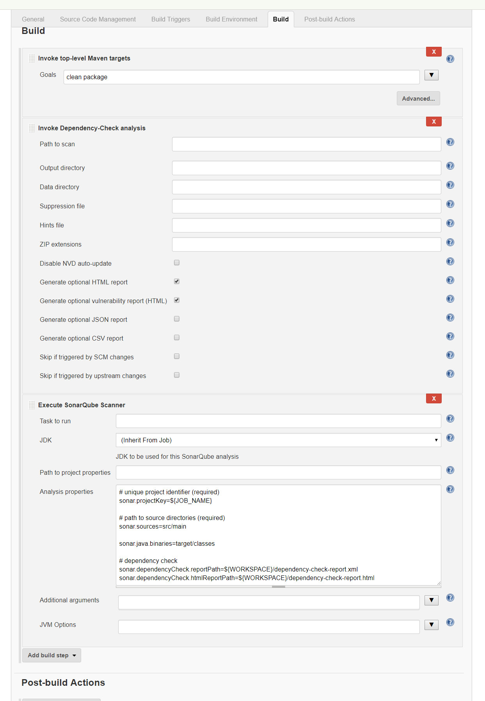

# DevSecOps

## 在Jenkins中调用Owasp DependencyCheck,Sonarqube,Spotbugs
解决两大类实际问题：
1. 使用DependencyCheck检查通用型组件的已知漏洞
2. 使用Sonarqube + SpotBugs进行静态代码扫描

实现的效果
1. Jenkins自动化调用Owasp DependencyCheck,Sonarqube,Spotbugs
2. 在Sonarqube中统一结果

已知的缺点
1. DependencyCheck以及静态扫描的结果存在漏报、误报的可能性
2. Sonarqube,SpotBugs某些规则报告的结果需要人工复核
3. 这几个工具结合起来的配置缺乏详细的官方文档，相关配置可能需要随版本发生变化
4. 这几个工具自身可能存在bug

#### Sonarqube
官方给出了一个不是特别详细的说明文档[https://docs.sonarqube.org/display/SCAN/Analyzing+with+SonarQube+Scanner+for+Jenkins](https://docs.sonarqube.org/display/SCAN/Analyzing+with+SonarQube+Scanner+for+Jenkins)

这里补充一些实际使用时候发现的结果,至少有两种方式可以在Jenkins实现Sonarqube的自动调用

1. 第一种是使用maven，这种方式不需要特别的Jenkins的配置，和一般build中的maven配置没有很大区别
  	- 这种方式不会在Jenkins出现Sonarqube的图标和连接
  	- 这种方式可以在Sonarqube中查看相关结果

```mvn sonar:sonar Dsonar.host.url=http://$SONAR_IP:9000 Dsonar.login=$SONAR_TOKEN```


2. 第二种方式是参考官方的说明文档，插件[https://plugins.jenkins.io/sonar](https://plugins.jenkins.io/sonar)的安装及Manage Jenkins/Configure System参照教程即可，接着在Manage Jenkins/Global tool configuration中配置SonarQube Scanner，选择自动安装即可
  	- 这种方式在配置任务时候**需要配置sonar.java.binaries**这个参数以指定.class文件的位置，原因参考[https://docs.sonarqube.org/display/PLUG/Java+Plugin+and+Bytecode](https://docs.sonarqube.org/display/PLUG/Java+Plugin+and+Bytecode)
  	- 这种方式可以在Jenkins出现Sonarqube的图标和链接

#### Owasp DependencyCheck
- 只要在Jenkins中安装OWASP Dependency-Check Plugin即可
- 在build阶段maven/ant执行后，sonar执行前进行DependencyCheck
- 需要勾选在Advanced中勾选```Generate optional HTML report```以及```Generate optional vulnerability report (HTML)```，否则sonarqube只有结果无具体报告
- 需要在sonar的配置中指定dependencyCheck的报告路径

#### TODO: spotbugs
#### Sonarqube 6.7.x(LTS)版本实测相关配置及结果




 Jenkins中Sonarqube配置
```
# unique project identifier (required)
sonar.projectKey=${JOB_NAME}

# path to source directories (required)
sonar.sources=src/main

# path to binaries (required)
sonar.java.binaries=target/classes  

# dependency check
sonar.dependencyCheck.reportPath=${WORKSPACE}/dependency-check-report.xml
sonar.dependencyCheck.htmlReportPath=${WORKSPACE}/dependency-check-report.html
```


