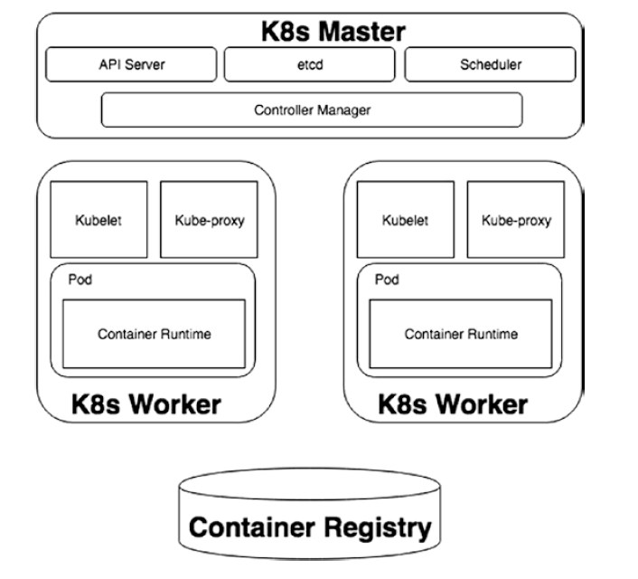

# MicroK8s
+ 历史的车轮滚滚而来, DevSecOps也需要拥抱[云原生](https://developer.aliyun.com/article/742723)
+ 拥抱变化的第一步就是了解变化
+ MicroK8s提供了一个适合本地测试/研究用的比较完整技术栈


## Part 1: About [kubernetes](https://kubernetes.io/docs/concepts/overview/components/)
可以简单理解kubernetes是为容器加入各种管理编排功能, 比如HA、水平自动伸缩等





### 1.1 Kubernetes Master
+ api server: the front end of a Kubernetes control plane. It maintains RESTful web services to define and configure a Kubernetes cluster

+ [etcd](https://etcd.io/docs/): a highly available component maintaining a record of all the objects running in the system. (distributed key-value storage based on Raft)

+ scheduler: this schedules workloads on Kubernetes workers in the form of pods

+ controller manager: this runs controllers in the background that are responsible for different important tasks in the cluster. Controllers keep watch on etcd for configuration changes and take the cluster to the desired state; on the other end, the control loops watch for the changes in the cluster and work to maintain the desired state as per etcd
    + node controller: This monitors the nodes in the cluster and responds when a node comes up or goes down. This is important so the scheduler can align pods per the availability of a node and maintain state per etcd
    + endpoint controller: This joins services and pods by creating endpoint records in the API, and it alters the DNS configuration to return an address pointing to one of the pods running the service
    + replication controller: replication is a general practice to maintain the high availability of an application. The replication controller makes sure the desired number of pod replicas/copies is running in the cluster.

### 1.2 Kubernetes Workers
+ Kubelet: the primary node agent running on each node and monitoring that the containers on the node are running and healthy. Kubelet takes a set of PodSpecs, which is a YAML or JSON object describing a pod, and monitors the containers described in those specs only. Note that there can be other containers, other than the containers listed in PodSpecs, running on the node, but Kubelet does not monitor these containers

+ Kube-proxy: The Kubernetes master scheduler usually runs multiple services on a node. Kube-proxy creates a network proxy and load balancer for these services. It can do simple TCP, UDP, and SCTP stream forwarding or round-robin TCP, UDP, and SCTP forwarding across a set of back ends. It also allows, if configured, nodes to be exposed to the Internet

+ Pods: A pod is the smallest unit of the Kubernetes object model that can be created, deployed, or destroyed. A Kubernetes pod usually has a single container but is allowed to contain a group of tightly coupled containers as well. A pod represents a running process on a cluster. It can be used in two broad ways
    + Single-container pod: This was the most common Kubernetes use case, also called one container per pod. The pod wraps the container and provides an abstract layer to Kubernetes to access or modify the container
    + Multiple-container pod: There are scenarios when an application requires multiple tightly coupled containers that are sharing resources. In such scenarios, a pod builds a wrapper on these containers and treats them as a single service. An example would be one container serving REST APIs to end users, with a sidecar counting the number of requests implementing the API limitation. The containers inside a pod share the same IP that was given to the pod and share the same set of storage. 

+ container runtime: A container is a unit of code packaged with its dependencies that creates an artifact that can run quickly on different computing environments(不仅仅有Docker, 还有如Rocket等)

+ container registry: each container generation requires code development, adding libraries from different package managers and creating the basic environment to run the code A container can be built every time when deploying, but getting the latest code, getting new libraries, and preparing the environment every time is time-consuming. To simplify this, developers store their once-created container and use it whenever required. The container registry is the place that allows developers to save their container images and use them as and when required

### 1.3 Kubernetes Terminology
+ deployment: an abstract unit built on pods

+ image

+ kubectl

+ namespaces

+ replicaset

+ service: a description of how an application deployed on one or multiple pods can be accessed internally or externally

+ StatefulSet

## Part 2: MicroK8s in Action
### 2.1 Install & config
基于Ubuntu LTS
```bash
# Install the microk8s snap
sudo snap install microk8s --classic --channel=1.18/stable

# Check the status
sudo microk8s status --wait-ready

# Turn on standard services
sudo microk8s enable dns dashboard registry ingress

echo "alias kubectl='microk8s kubectl'" >> ~/.bashrc

# check status
microk8s.kubectl get all
microk8s.kubectl get all --all-namespaces


microk8s.kubectl delete deployment/nginx
microk8s.kubectl delete svc/nginx
```

参考[https://www.thegeekdiary.com/how-to-access-kubernetes-dashboard-externally/](https://www.thegeekdiary.com/how-to-access-kubernetes-dashboard-externally/)使得可以从外部访问dashboard
```bash
kubectl -n kube-system edit service kubernetes-dashboard
# change clusterIP to NodePort

root@microk8s:~# kubectl -n kube-system get services
NAME                        TYPE        CLUSTER-IP       EXTERNAL-IP   PORT(S)                  AGE
dashboard-metrics-scraper   ClusterIP   10.152.183.150   <none>        8000/TCP                 10h
heapster                    ClusterIP   10.152.183.9     <none>        80/TCP                   10h
kube-dns                    ClusterIP   10.152.183.10    <none>        53/UDP,53/TCP,9153/TCP   10h
kubernetes-dashboard        NodePort    10.152.183.233   <none>        443:32392/TCP            10h
monitoring-grafana          ClusterIP   10.152.183.107   <none>        80/TCP                   10h
monitoring-influxdb         ClusterIP   10.152.183.123   <none>        8083/TCP,8086/TCP        10h

# Get token
kubectl -n kube-system describe $(kubectl -n kube-system get secret -n kube-system -o name | grep namespace)


# visit at https://external-ip:32392/#/login
```

### 2.2 Deployments
TODO
```yaml

```